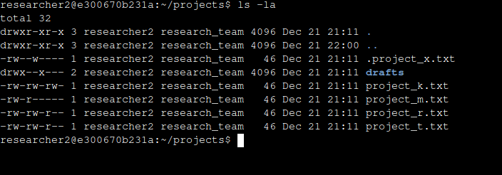
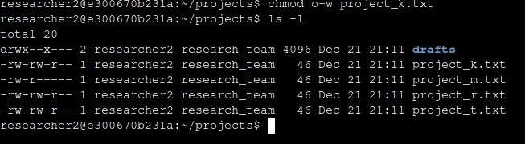
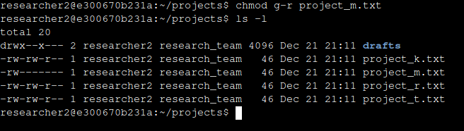
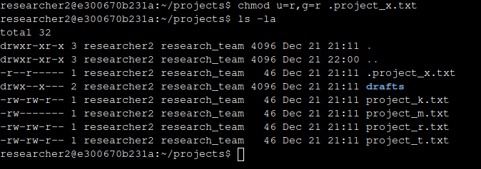
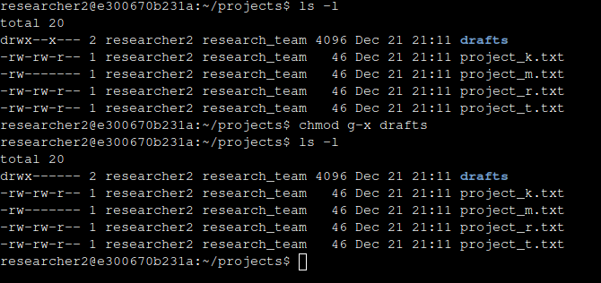

File Permissions in Linux

Project Description

In this project I reviewed and changed file and directory permissions using the Linux shell.

Check File and Directory Details

First, I navigated to the *projects* directory. I checked the contents and permissions of this directory including hidden files and directories. The permissions strings for each file contained a variety of different permissions for each file. 

* **1st character:** This character is either a ‘d’ or a hyphen (-). If it is a ‘d’, it is a directory. If it’s a hyphen, it’s a file.  
* **2nd-4th characters:** These characters represent the User owner type permissions. ‘r’, ‘w’, and ‘x’ represent read, write, and execute respectively. If there is a hyphen then the User owner type does not have that permission.  
* **5th-7th characters:** These characters represent the Group owner type permissions. ‘r’, ‘w’, and ‘x’ represent read, write, and execute respectively. If there is a hyphen then the Group owner type does not have that permission.  
* **8th-10th characters:** These characters represent the Other owner type permissions. ‘r’, ‘w’, and ‘x’ represent read, write, and execute respectively. If there is a hyphen then the Other owner type does not have that permission.

All files and directories had read and write access for Users as seen by the ‘rw’ portion of each string’s 2nd through 4th characters. 

Change File Permissions

I was asked to identify if any files in this directory had write permissions for the ‘other’ type owner. You can see that ‘project\_k.txt’ has write permissions in the image above. I was then asked to remove the write permissions. I did so by running the command ‘chmod o-w project\_k.txt’ as seen in the image below. 

I was asked to remove the read and write permissions of ‘project\_m.txt’ because it is a restricted file and only user’s should have access to it. I identified that Group only had read permissions and Other had no permissions, so I ran ‘chmod g-r project\_m.txt’ to remove that permission. 

I was asked to remove all permissions except for the read permissions of User and Group on the hidden file ‘.project\_x.txt’ because it has been archived. I did so by running the command ‘ls \-la’ to check hidden file permissions and ‘chmod u=r,g=r .project\_x.txt’.

Change Directory Permissions

I was asked to check the permissions of the *drafts* directory and ensure that Group could not access it. I noted that Group currently had execute permissions which allowed them to access the directory. I ran the command ‘chmod g-x drafts’ to remove this permission.   

Summary

I was asked to review the permissions for a number of files and permissions in the project directory. I did so by using the Linux shell. I ran commands such as ls with modifiers \-l and \-la. I also used the chmod command to change permissions for different owner types. 
