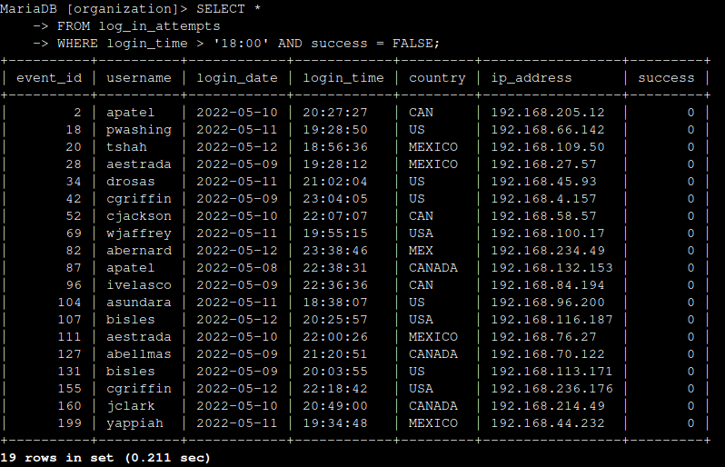
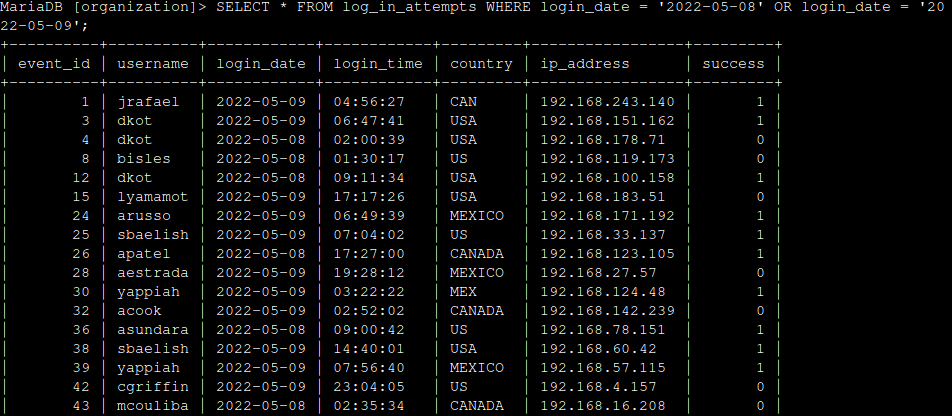
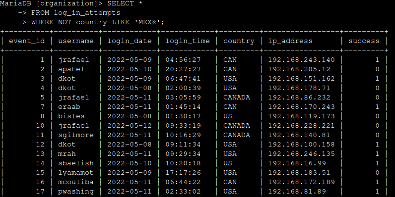
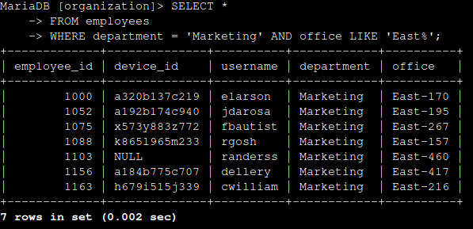
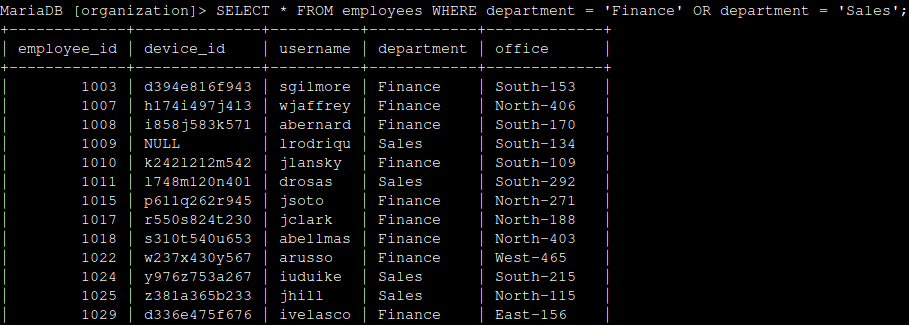
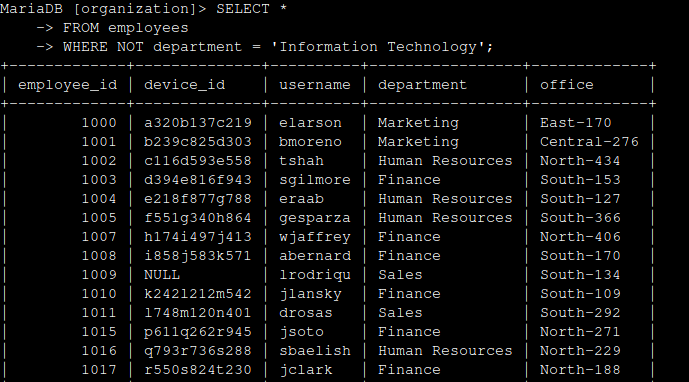

# SQL Queries

## Project Description

In this project I was asked to perform various SQL queries to investigate security issues in an organization.

## Investigating Login Attempts

First, I was asked to investigate failed login attempts that were made after business hours which end at 18:00 (6:00 pm). In the database successful login attempts are recorded in a column named 'success' as a boolean of TRUE or FALSE. To get this information I ran the following:

`SELECT * FROM log_in_attempts WHERE login_time > '18:00' AND success = FALSE;`

This showed that there were 19 failed login attempts made after business hours. Shown below:

I was then asked to find all login attempts that occurred on '2022-05-08' and '2022-05-09' to help with an investigation. I ran the following SQL query to collect the information.

`SELECT * FROM log_in_attempts WHERE login_date = '2022-05-08' OR login_date = '2022-05-09';`

This returned 75 results, but I've provided a sample of 17 below.

I needed to discover how many login attempts were made outside of Mexico. The country is stored as both 'MEX' and 'MEXICO', so in order to collect all instances of logins outside of Mexico I had to use the LIKE operator along with the '%' wildcard to search for both possibilties in the following command:

`SELECT * FROM log_in_attempts WHERE NOT country LIKE 'MEX%';`

This returned 144 rows meaning there were 144 login attempts that occurred outside of Mexico. A sample of these results are shown below.

## Information for Security Updates

I was asked to help identify employee machines that need updates. First, I needed to find all Marketing department employees in the East building. To do so I ran the following SQL query:

`SELECT * FROM employees WHERE department = 'Marketing' AND office LIKE 'East%';`

There are seven marketing employees in the east building, shown below:

The team also needed to update the systems for all employees in the Finance and Sales department. To find these employees I ran the following query:

`SELECT * FROM employees WHERE department = 'Finance' OR department = 'Sales';`

There are 71 employees in either the Finance department or the Sales department. Below is a sample of the results of the query:

The last update needed to be made to all employee's machines that are not in the IT department. This is because the update was already made to these systems. To find these employees I ran the following query:

`SELECT * FROM employees WHERE NOT department = 'Information Technology';`

This showed that there are 161 employee's systems that need this update.

## Summary

I was asked to help investigations into login attempts after business hours, on a specific date, and outside of specific region. I was also asked to help identify employee machines that required updates. In order to do this I utilized SQL queries to the company database. These query results helped the team quickly find the information they needed to complete their tasks.
